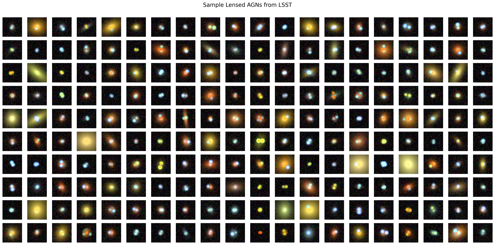

# Lensed AGN Forecasts

This repository uses [`slsim`](https://github.com/LSST-strong-lensing/slsim) to simulate and forecast the yields and physical properties of strongly lensed AGNs (quasars) across upcoming astronomical surveys, including Rubin LSST and the Roman Space Telescope (Medium, Wide, and NANCY tiers).

**Contacts:** Paras Sharma ([github@timedilatesme](https://github.com/timedilatesme), paras.sharma@stonybrook.edu)

## Stats of different samples

| Survey | Sky Area (deg²) | Total Lensed-AGN | Doubles | Quads | Quad Fraction | Image Sep Cuts (") | Mag Cuts (2nd Brightest Image) |
| :--- | :--- | :--- | :--- | :--- | :--- | :--- | :--- |
| LSST | 20,000 | 2,264 | 2,000 | 264 | 11.7% | 0.5 - 4.0 | i &lt; 23.3 |
| Roman Medium Tier | 2,415 | 1,983 | 1,826 | 157 | 7.9% | 0.2 - 4.0 | F106 &lt; 26.5, F129 &lt; 26.4, F158 &lt; 26.4 |
| Roman Medium Tier (2029) | 500 | 412 | 384 | 28 | 6.8% | 0.2 - 4.0 | F106 &lt; 26.5, F129 &lt; 26.4, F158 &lt; 26.4 |
| Roman Wide Tier | 2,702 | 2,233 | 2,038 | 195 | 8.7% | 0.2 - 4.0 | F158 &lt; 26.2 |
| Roman NANCY | 1,000 | 628 | 564 | 64 | 10.2% | 0.2 - 4.0 | F158 &lt; 25.5 |

## Images of different samples

